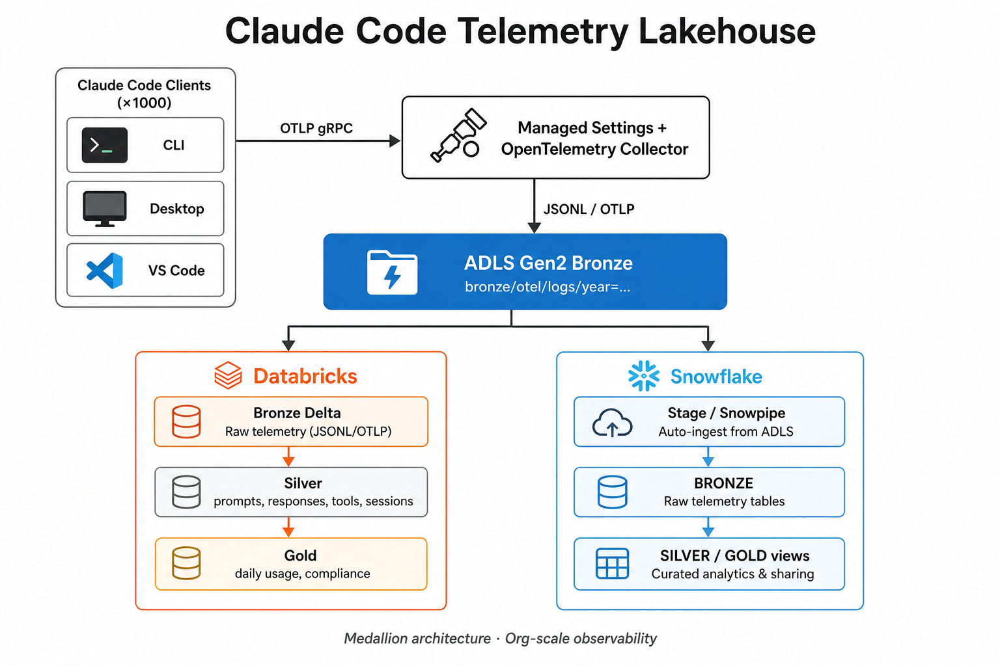
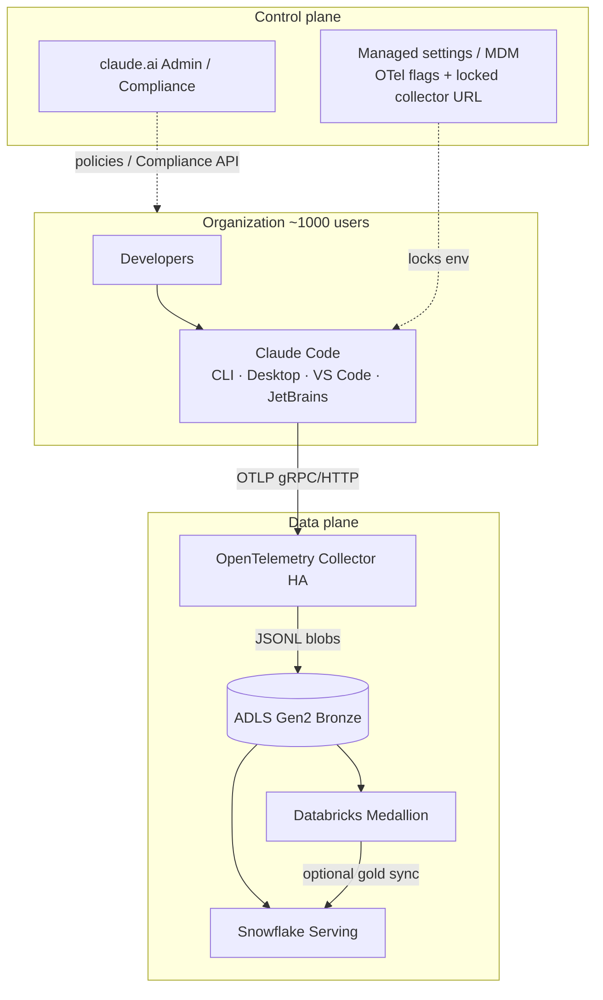
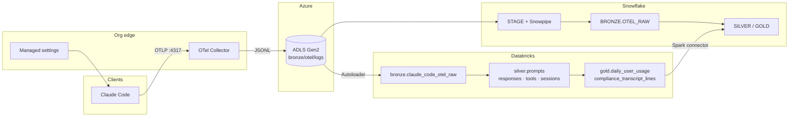
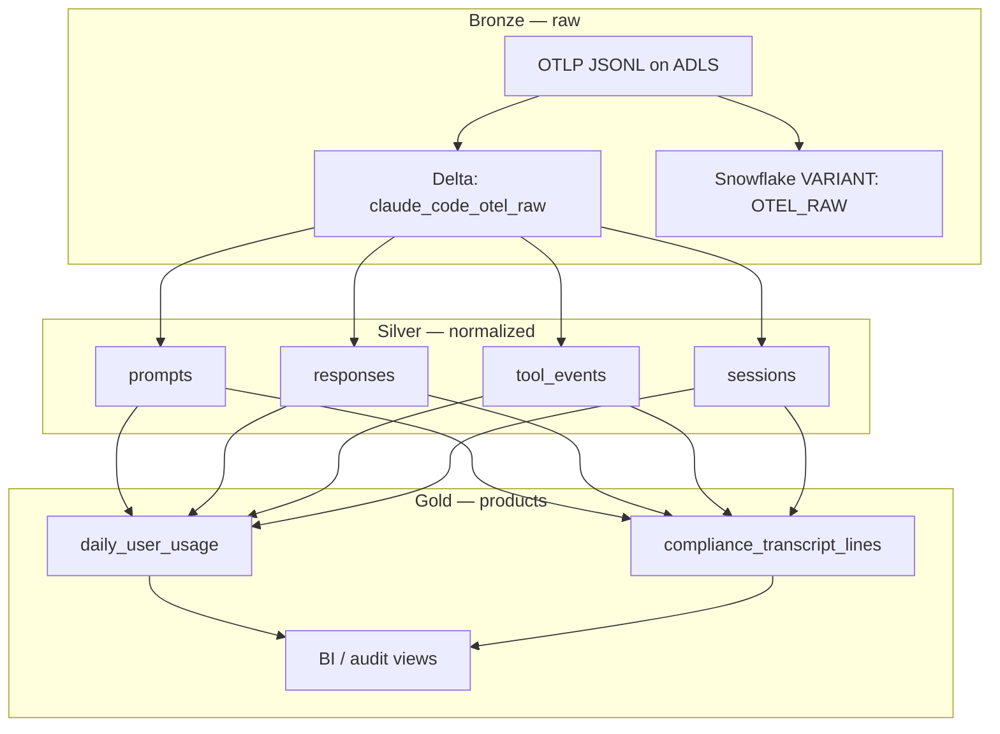
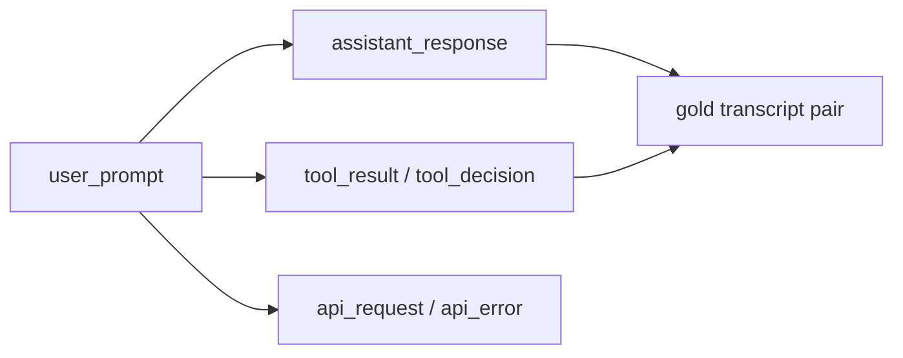
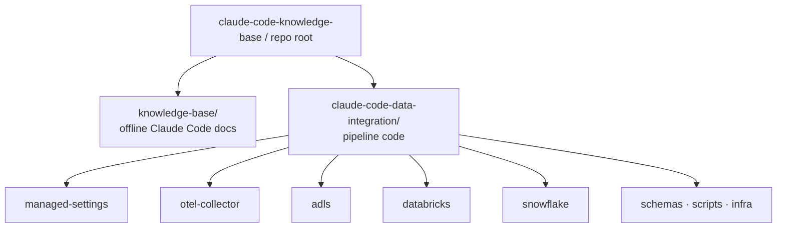
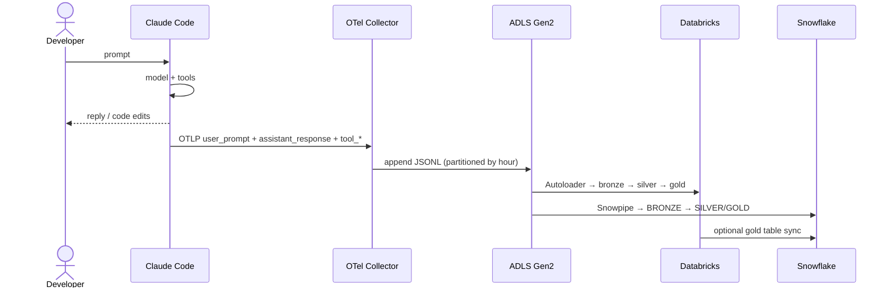

# Architecture

End-to-end design for this repository: capture Claude Code prompts, replies, and tool activity at org scale, land them on **ADLS Gen2**, transform in **Databricks**, and serve from **Snowflake**.

---

## 1. System context

---

## 2. Data flow (runtime)

---

## 3. Medallion layers

| Layer | Store | Contents |
|-------|-------|----------|
| **Bronze** | ADLS + Databricks Delta + Snowflake VARIANT | Raw OTel log records |
| **Silver** | Databricks Delta (+ optional Snowflake) | Typed prompts, responses, tools, sessions |
| **Gold** | Databricks + Snowflake | Daily usage, compliance transcript lines, BI views |

---

## 4. What is captured

| Event | Managed setting |
|-------|-----------------|
| Prompt text | `OTEL_LOG_USER_PROMPTS=1` |
| Reply text | `OTEL_LOG_ASSISTANT_RESPONSES=1` |
| Tool names / inputs | `OTEL_LOG_TOOL_DETAILS=1` |
| Tool I/O content | `OTEL_LOG_TOOL_CONTENT=1` |
| Full API bodies | `OTEL_LOG_RAW_API_BODIES` (optional) |

---

## 5. Repo layout

| Path | Role |
|------|------|
| [`architecture-diagram.png`](./architecture-diagram.png) | Visual architecture poster |
| [`knowledge-base/`](./knowledge-base/) | Official docs mirror |
| [`claude-code-data-integration/`](./claude-code-data-integration/) | Pipeline skeleton |

---

## 6. Sequence (one prompt)

---

## 7. Design principles

1. **ADLS Gen2 is the raw system of record** — Databricks and Snowflake both consume bronze independently.
2. **Collector is the only OTLP sink** — managed settings lock the endpoint.
3. **Medallion separation** — raw forever in bronze; PII controls on gold/compliance.
4. **Idempotent keys** — `session.id` + `event.sequence` / `prompt.id` / `message.uuid`.
5. **Fail closed on destination** — users cannot redirect telemetry when settings are managed.

Detailed pipeline notes: [`claude-code-data-integration/ARCHITECTURE.md`](./claude-code-data-integration/ARCHITECTURE.md).
