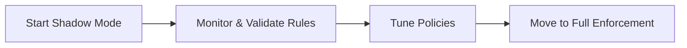

# 02. Configuration and Setup

This module covers the prerequisites, configuration steps, and rollout strategies for deploying Inference Hooks in your organization.

---

## 📋 Prerequisites

> [!IMPORTANT]
> Your organization must be on the **Claude Enterprise** plan to access and configure Inference Hooks.

---

## ⚙️ Configuration Steps

Inference Hooks are configured in the **Admin console** under the **Data & Compliance** section.

Follow these steps to set up your integration:

1. **Set Webhook Endpoint URL**: Provide the HTTPS URL of your security server that will evaluate the payloads.
2. **Configure Authentication**: Set up **Standard Webhooks** signature verification to ensure payloads genuinely originate from Anthropic.
3. **Set Timeout**: Configure the maximum round-trip time allowed (the default is **5 seconds**).
4. **Configure Failure Handling**: Choose your failure mode strategy (**Fail closed** vs **Fail open**).
5. **Select Enforcement Mode**: Choose between **Shadow mode** (monitoring only) or **Full enforcement** (active blocking).

---

## 👥 Supported Security Vendors

You can integrate Inference Hooks with custom-built security endpoints or leverage out-of-the-box integrations with leading security vendors:

- **Palo Alto Networks**
- **Proofpoint**
- **Zscaler**
- **Metomic**
- **Custom-built endpoints** (your own internal DLP/security APIs)

---

## 🚀 Rollout Strategy

When deploying Inference Hooks, it is highly recommended to follow a phased rollout to avoid disrupting user productivity.

### Shadow Mode

**Shadow mode** allows you to monitor traffic and observe potential verdicts without actually blocking user requests. This is critical for:
- Evaluating baseline traffic.
- Tuning DLP policies and regex rules.
- Identifying and reducing false positives.

### Recommended Path to Enforcement

1. **Start in Shadow Mode**: Deploy the integration with enforcement disabled.
2. **Validate Rules**: Analyze the logs to see what *would* have been blocked.
3. **Move to Enforcement**: Once you are confident that false positives are minimized, toggle to Full Enforcement.

---
*Next Module: [03. Webhook Schema and Verdicts](03_webhook_schema_and_verdicts.md)*
