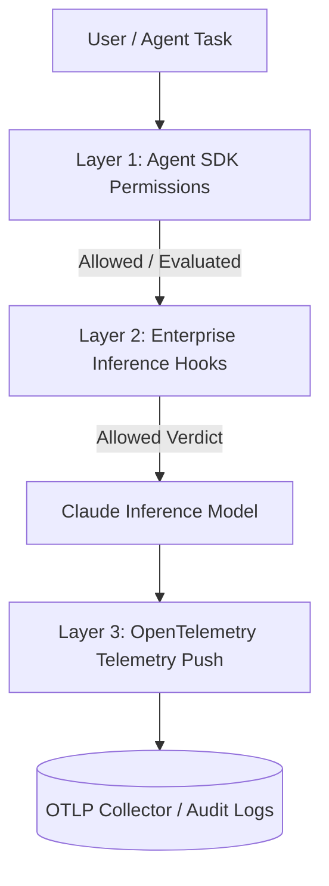

# 05. Security and Governance Comparison

This module provides a comparative architecture matrix evaluating Agent SDK Permissions, Enterprise Inference Hooks, and OpenTelemetry monitoring to help security architects design defense-in-depth governance.

---

## 🏛️ 3-Way Security & Governance Matrix

Claude Code and the Claude Agent SDK provide three distinct security and governance control layers:

| Security Dimension | Layer 1: Agent SDK Permissions | Layer 2: Enterprise Inference Hooks | Layer 3: OpenTelemetry (OTEL) |
| :--- | :--- | :--- | :--- |
| **Primary Scope** | Client-Side / Application Tool Execution | Server-Side Enterprise Prompt Governance | Observability & Operational Telemetry |
| **Execution Timing** | Pre-tool call evaluation (inline) | Pre-inference payload inspection (inline HTTPS POST) | Post-event / Near real-time push streaming |
| **Enforcement Surface** | Local process tools, file ops, CLI commands | Organization-wide prompts across `claude.ai`, Code, and Cowork | Session metrics, token spend, tool decision counts, structured logs |
| **Action Capability** | Allow, Deny, Prompt via `canUseTool`, or execute Mode | Allow or Deny verdict with customizable user message | Passive monitoring, metric aggregation, alert triggering |
| **Target Audience** | Software Developers, Agent SDK Developers | Enterprise Security, DLP Officers, Compliance Teams | Platform Engineering, DevOps, FinOps Teams |
| **Availability** | All Claude Code & Agent SDK installations | Claude Enterprise Plan Only | Claude Code CLI & Claude Cowork |

---

## 🛡️ Defense-in-Depth Governance Strategy

For maximum security and auditability, organizations should layer all three capabilities:

1. **Client-Side Boundaries (Agent SDK Permissions)**: Use `permissionMode: "dontAsk"` and scoped `disallowedTools` (`Bash(rm *)`, `Edit(//secrets/**)`) to constrain what tools an agent process can execute locally.
2. **Server-Side DLP (Inference Hooks)**: Enforce central DLP policies to block PII, secret keys, or prompt injections before requests reach Claude's models.
3. **Operational Auditing (OpenTelemetry)**: Stream metrics and event logs to a central collector to audit cost per user, track tool usage, and monitor policy compliance over time.

---

## Related docs

- [Enterprise Inference Hooks](enterprise-inference-hooks/01_overview_and_concepts.md)
- Official: [Monitoring (OTel)](../docs/en/monitoring-usage.md) · [Permissions](../docs/en/permissions.md) · [Agent SDK permissions](../docs/en/agent-sdk/permissions.md)
